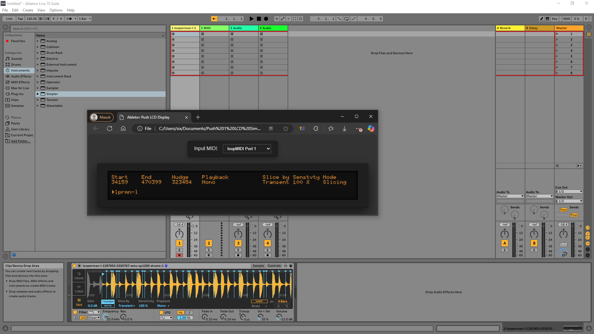
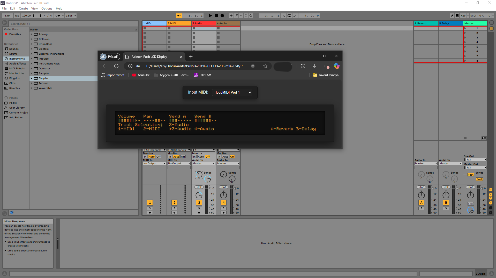
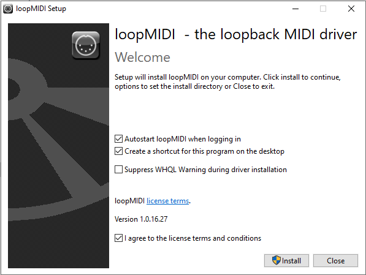
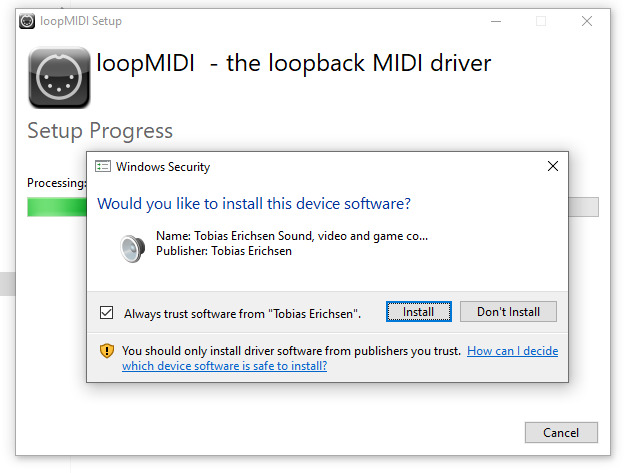
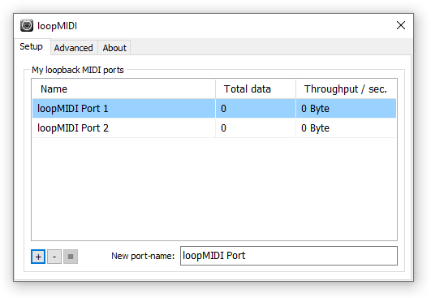
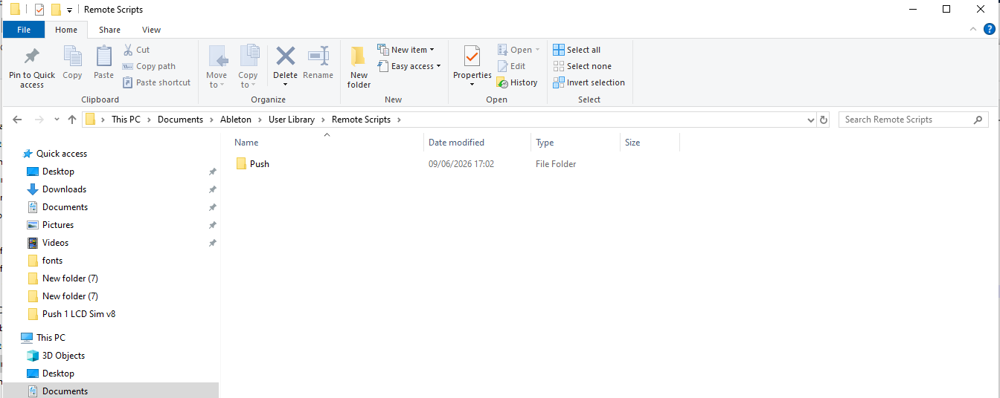
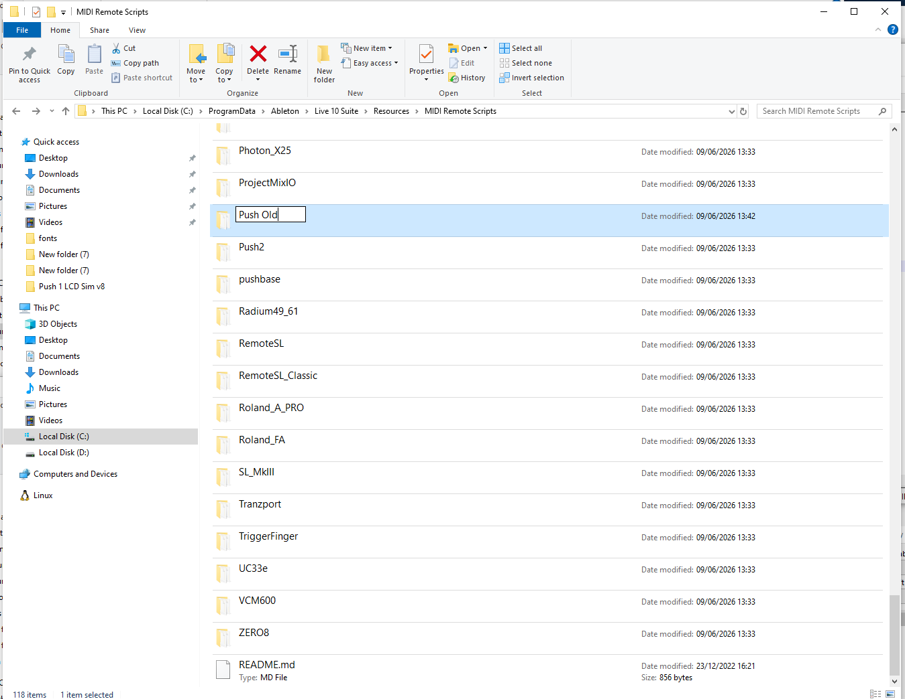
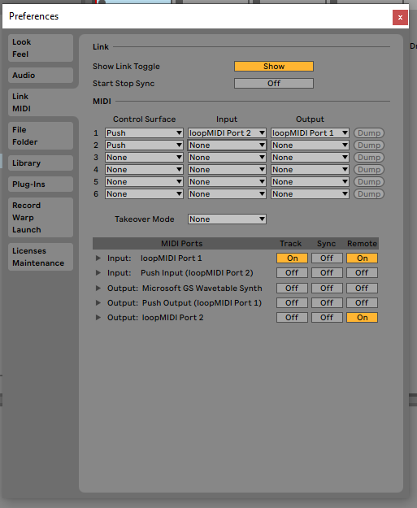
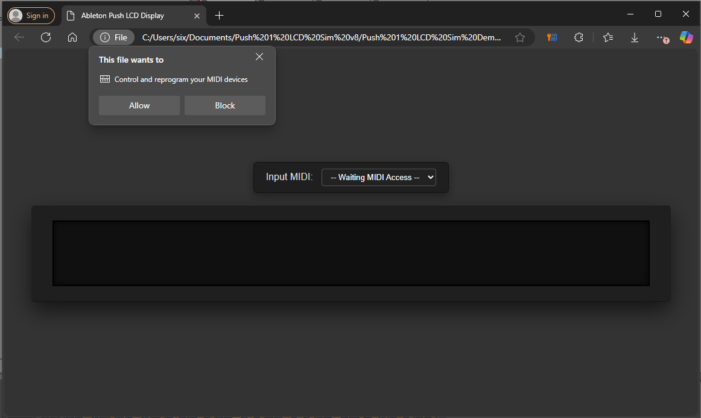

README.md
# Ableton Push 1 LCD Display Simulation Custom MIDI Controller
Ableton Push 1 LCD Display Simulation &amp; Custom Push MIDI Controller

[Website Link Ableton Push 1 LCD Display Simulation](https://sixnine0.github.io/)

#
Welcome! This project allows you to run a simulation of the Ableton Push 1 LCD screen directly in your web browser, controlled by a custom/external MIDI controller. This guide will walk you through the necessary requirements and step-by-step setup to get everything running smoothly.

 

---

## 🛠️ Prerequisites & Requirements

Before getting started, make sure you have the following:

1. **Ableton Push 1 LCD Simulation**
   * Web version (Free): `[Insert Free Link Here]`
2. **MIDI Controller with Rotary Knobs (Optional)**
   * Must support **Relative** CC value settings.
3. **2-Channel Virtual MIDI Software**
   * You can use any software & midi driver.
   * but we are currently using **LoopMIDI by Tobias Erichsen**.
   * Download LoopMIDI: [loopMIDISetup_1_0_16_27.zip](https://www.tobias-erichsen.de/wp-content/uploads/2020/01/loopMIDISetup_1_0_16_27.zip)
4. **Ableton Push Remote Script (Custom)**
   * for Ableton Live 9 & Ableton Live 10
   * Download here: [Ableton Remote Script](https://github.com/LuthfiRaid69/Ableton-Push-1-LCD-Display-Simulation-Custom-MIDI-Controller/releases/download/Midi_Remote_Scripts/Midi_Remote_Scripts.zip)

---

## 🚀 Step-by-Step Installation Guide

### Step 1: Virtual MIDI Setup
You will need virtual MIDI ports to route the data between your browser and Ableton Live.

1. Download and install **LoopMIDI** using the link provided above.
2. Open LoopMIDI and create **two new virtual MIDI ports**.
3. Name them something easily identifiable (e.g., `loopMIDI Port 1` and `loopMIDI Port 2`).
*(See screenshot below for reference)*

  

### Step 2: Install the Custom Ableton Remote Script
You need to install the custom script and disable the default Ableton Push script to prevent conflicts.

1. Extract the downloaded **Push Remote Scripts (Custom)** `Midi_Remote_Scripts.zip` file.
2. Choose the correct script folder for your version of Ableton (Ableton 9 or Ableton 10) and copy it.
3. Paste the `Remote Scripts` folder into your Ableton User Library:
   * **Windows:** `C:\Users\[Your Username]\Documents\Ableton\User Library\`
   * **Mac:** `Macintosh HD/Users/[Your Username]/Music/Ableton/User Library/`
4. **Important:** You must rename Ableton's default Push script to prevent it from loading. Navigate to Ableton's core script folder, find the folder named `Push`, and rename it to `Push Old`.
   * **Windows location:** `C:\ProgramData\Ableton\Live [Version]\Resources\MIDI Remote Scripts\` 
     *(Note: `ProgramData` is a hidden folder by default).*
   * **Mac location:** Right-click the Ableton Live application icon in your Applications folder → Select **Show Package Contents** → Navigate to `Contents/App-Resources/MIDI Remote Scripts/`

### Step 3: MIDI Controller Configuration
You can use external MIDI controllers like the Novation Launchkey MK4 or similar hardware.

1. Set up your MIDI controller's CC mapping. *(See screenshot below for reference)*
`[Insert Image of MIDI CC Map Setup]`

2. Configure your knobs to use the **Relative** method. Ensure the values are set as follows:
   * **Center Value:** `0`
   * **Turn Left (-1):** `127`
   * **Turn Right (+1):** `1`

### Step 4: Ableton Settings
Now, link your Virtual MIDI and physical MIDI controller inside Ableton Live.

1. Open Ableton Live and go to **Preferences > Link/Tempo/MIDI**.
2. **Setup the Push Control Surface:**
   * **Control Surface:** `Push`
   * **Input:** `loopMIDI Port 2` (without MIDI Controller)
   * **Input:** `[Your Hardware MIDI Controller Name]` (with MIDI Controller)
   * **Output:** `loopMIDI Port 1`
3. **Setup Your Physical MIDI Controller:**
   * **Control Surface:** `Push`
   * **Input:** `[Your Hardware MIDI Controller Name]`
   * **Output:** `[Your Hardware MIDI Controller Name]`
4. Finally, configure your MIDI Ports (Track, Sync, Remote) as shown in the reference image below:

 

### Step 5: Running the Simulation
Once everything is routed, you are ready to launch!

1. Open the [**Ableton Push 1 LCD Simulation**]((https://sixnine0.github.io/)) in your preferred web browser (Google Chrome, MS Edge, Firefox, etc.).
2. Your browser will ask for permission to access your MIDI devices. Click **Allow** / **Agree**.
3. In the web application settings, select `loopMIDI Port 1` as the data source.
4. The Push 1 LCD simulation will now run on your screen, and your physical MIDI controller will interact directly with the interface and Ableton Live!

  
